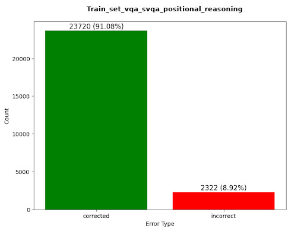
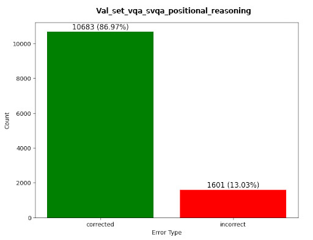
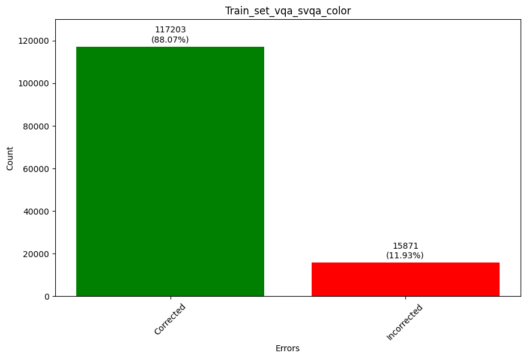
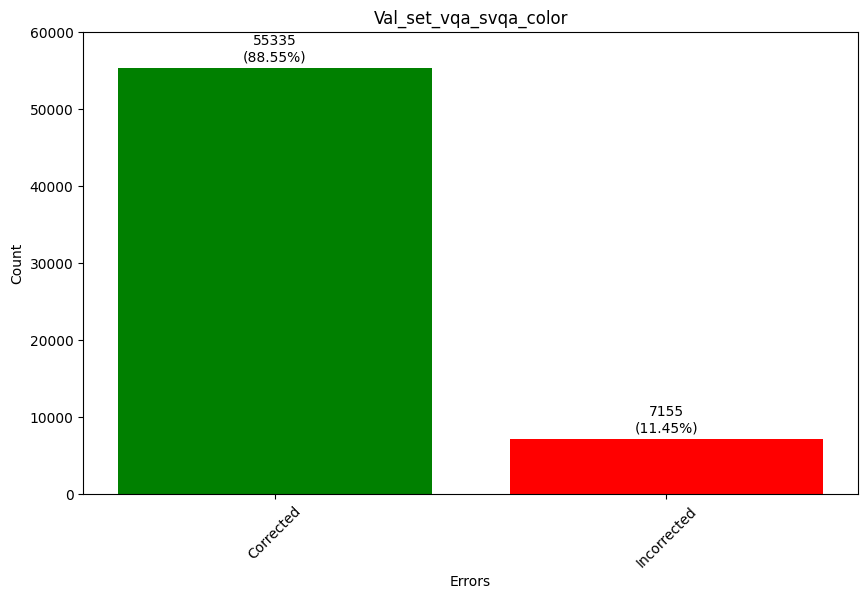
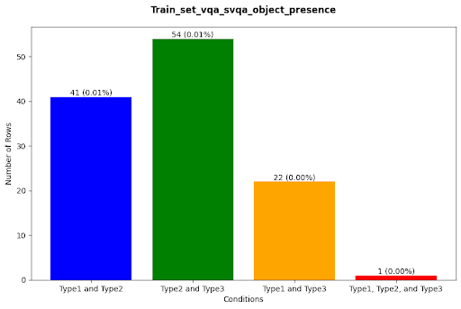
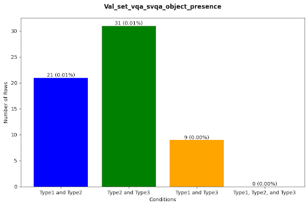

<!-- 
RULES TO FOLLOW BEFORE CONTRIBUTING:

Please refer to the README.md and install the extensions provided.
Images/Flowcharts should go inside the images directory.
Helpful comments are provided above the section for further info.
Comments should be added by the respective contributor to ensure the report is well documented.
 -->

<!-- Picture of IITG and KU goes here; refer to the BSM document sent in the group chat -->
# Internship Report

<!-- use this to insert a page break -->

# Acknowledgement
lorem ipsum

# Abstract
Development of Data cleaning and correction pipeline was made possible using modern tech

<!-- The Table of content autopopulates as new sections are added; no need to manually make changes -->
# Table of contents
- [Internship Report](#internship-report)
- [Acknowledgement](#acknowledgement)
- [Abstract](#abstract)
- [Table of contents](#table-of-contents)
- [Project Objectives](#project-objectives)
  - [Understanding the dataset](#understanding-the-dataset)
- [Methodology](#methodology)
- [Data correction](#data-correction)
  - [Approaches](#approaches)
    - [Approach #1 (nltk method)](#approach-1-nltk-method)
      - [Algorithm](#algorithm)
      - [Flowchart](#flowchart)
    - [Approach #2 (LLM method)](#approach-2-llm-method)
      - [Flowchart](#flowchart-1)
- [Error Analysis](#error-analysis)
  - [Type 1 Error (Context Error)](#type-1-error-context-error)
      - [Algorithm](#algorithm-1)
      - [Output](#output)
  - [Type 2 Error (Grammatical Error)](#type-2-error-grammatical-error)
      - [Algorithm](#algorithm-2)
      - [Output](#output-1)
  - [Type 3 Error (Typographical Error)](#type-3-error-typographical-error)
      - [Algorithm](#algorithm-3)
      - [Output](#output-2)
  - [Finding Commonalities between the Errors](#finding-commonalities-between-the-errors)
      - [Algorithm](#algorithm-4)
      - [Output](#output-3)
- [Conclusion](#conclusion)

# Project Objectives

The Task Directed Image Understanding Challenge (TDIUC) dataset is a collection of data for Visual Question Answering (VQA). It comprises 1.6 million questions and 170,000 images gathered from sources like MS COCO and the Visual Genome Dataset. Each question posses an short answer. These questions are paired with images and categorized into 12 distinct groups. The various question categories are briefly defined in the Table 1.
Additionally, there are four supplementary evaluation metrics designed to assess the robustness of models in handling imbalanced answers and their capacity to respond to questions demanding higher-level reasoning. TDIUC divides the VQA task into various question types, ranging from simpler ones like object presence and color attributes to more intricate tasks such as counting and positional reasoning. To balance the dataset, an “Absurd” question category is also included, where questions are unrelated to the image content. We have used the TDIUC dataset for Sentence-based Visual Question Answering (SVQA).

## Understanding the dataset

The answers which were initially written as single words, were converted to a complete sentence by using the three-step procedure shown in Fig.1. The initial step involves converting concise answers into complete sentences by applying a set of language rules, which are outilned and summarized in Fig.2.  the subsequent stage, sentences were
subjected to paraphrasing using the Pegasus paraphraser, a transformer-based model [6], to generate alternative answers to the questions. This is done to increase the dataset’s linguistic capacity and add variety to the answers. The last phase involves inspecting and correcting the grammar of the sentences through the utilization of
Gramformer [7], a transformer-based model. The table in 2 provides a summary of the grammatical accuracy of answers for each question type. We have not considered the Absured category as it only reply as “ does not apply”.

# Methodology

## Data correction

The process of analyzing the "long answer" column and implementing corrections is a complex task for various reasons. Firstly, the sheer volume of data, featuring 11 different categories, presents a significant challenge. Each group contains numerous entries that require individual examination and correction when necessary.

Secondly, the nature of the errors demands sophisticated techniques for identification and correction. Additionally, context errors have emerged, where an entry does not align with its surrounding information or is inappropriate for its given situation. Addressing these context errors often necessitates additional domain-specific knowledge and manual review.

To address these challenges, we employ scripting techniques and Large Language Model-based (LLM) approaches. These methods enhance efficiency, reduce human error, and enable the processing of large amounts of data in a relatively short time.

Despite the enormity of the task involving extensive data and various error types, we successfully clean up the dataset, enhancing its overall quality.

1. **Dataset Analysis:**
   - Given VQA-SQVA datasets in CSV format with "long\_answer," "short\_answer," and "question" columns.
   - Identified errors by cross-referencing "long\_answer" with "short\_answer"; discrepancies were flagged for correction.

2. **Model Selection and Training:**
   - Utilized ChatGPT 3.5 as the Language Learning Model (LLM) for its ability to comprehend context and generate coherent responses, crucial for understanding nuances in question-answer pairs.
   - Applied prompt engineering and implemented In-Context Learning (ICL). The model was trained with specific question & short\_answer pairs, enabling it to grasp relationships between questions and corresponding short\_answers.
     - Example: Several triplets like these were given to the LLM:
       - Question: "What color is the sky?"
       - Short\_answer: "blue"
       - Long\_answer: "The color of the sky is blue."
     - The LLM was then asked to answer the value in "long\_answer":
       - question:"What color is the car?"
       - short\_answer:"red"
       - long\_answer: (Here the LLM responds)
   - Evaluated the model's responses iteratively, considering contextual correctness and coherence, and fine-tuned the training based on evolving performance.

3. **Iterative Processing:**
   - Divided the dataset into chunks of 50 rows due to input constraints.
   - Applied the trained ChatGPT iteratively on each chunk, generating 50 correct long\_answers for each question & short\_answer pair in the chunk.

4. **Data Integration and Refinement:**
   - Structured the output (50 long\_answers) in a single-column CSV format.
   - Appended the generated long\_answers to a file, forming a refined dataset.
   - Merged the refined dataset with the original, replacing erroneous values in the "long\_answer" column.

5. **Error Anticipation and Resolution:**
   - Acknowledged the possibility of introducing errors during modification.
   - Planned to address remaining errors using error detection methods in subsequent stages of the research pipeline.

By following these steps, the research team systematically improved the dataset's accuracy, laying the foundation for further enhancements and error resolution in the subsequent phases of the project.

#### Flowchart

# Error Analysis
## Type 1 Error (Context Error)

Our focus is on the identification of Type-1 errors, specifically contextual errors (CEC), within the SQVA datasets. The dataset comprises three pivotal columns: "long\_answer," "short\_answer," and "question." The core of our task lies in assessing the contextual accuracy of the "long\_answer" concerning a given pair of question and "short\_answer". To achieve this, we devised a systematic pipeline aimed at detecting Type-1 errors.

Our approach delves into the linguistic complexities of the dataset. We initiate the process by examining instances where the "short\_answer" is a single word, and the "question" is presented as an interrogative sentence. For these cases, we employ the Natural Language Toolkit (NLTK) library to extract nouns from both the "short\_answer" and the "question". These extracted nouns serve as critical anchors for contextual validation.

The next step involves comparing these nouns with the "long\_answer" sentence. If all the identified nouns are found within the "long\_answer", the Type-1 error is marked as 0, indicating that the answer is contextually correct. However, if even one of the nouns is absent in the "long\_answer", the Type-1 error is flagged as 1, signifying a contextual mismatch.

Through this innovative methodology, we aim to contribute significantly to the refinement of contextual understanding within the realm of question-answering systems, paving the way for more precise and accurate information retrieval. This rigorous approach ensures a careful evaluation, enhancing the quality and reliability of the VQA-SQVA datasets. The enriched dataset provides valuable insights into the contextual accuracy of "long\_answers" in the context of given "question" and "short\_answer" pairs within the VQA-SQVA datasets.

#### Algorithm

1. **Input:** *SVQA* Dataset *(SVQA\_D)* with Long Answer *(L\_A)*, Short Answer *(S\_A)*, and Question *(Q)*
2. **Output:** Context Error-free Sentences

**Procedure:**

- Tokenize *S\_A* and *Q* using NLTK library
- Extract Noun from *S\_A* (*NS\_A*) and *Q* (*NQ*) using NLTK library

For each row *NS\_A* and *NQ* in SVQA\_D:

- If *NS\_A* is in *L\_A* or *NQ* is in *L\_A*:
    - No error
- Else:
    - Error

#### Output
One of the dataset namely "Positional Reasoning" is shown as an example output containing Type 1 error:
Training            |  Validation
:-------------------------:|:-------------------------:
   |  

## Type 2 Error (Grammatical Error)

In this section, our focus is on Type 2 errors, with a specific goal of enhancing grammatical precision within the VQA-SQVA datasets. These datasets prominently include columns such as "long\_answer," "short\_answer," and "question." Our primary objective is to improve the grammatical accuracy of the long\_answer in the context of question and short\_answer pairs. To achieve this, we've developed an advanced methodology that combines the capabilities of SpaCy and Language Tool (LT) specialized in grammar checking and proofreading. By leveraging these techniques, we identify and rectify grammatical errors with a high degree of precision.

The code block includes conditions to filter and select specific errors, and the rules are as follows:

1. **match.ruleId != \`THE\_FALL\_SEASON' and match.ruleId != \`ADJECTIVE\_IN\_ATTRIBUTE':** This condition excludes errors with rule IDs \`THE\_FALL\_SEASON' and \`ADJECTIVE\_IN\_ATTRIBUTE'. Errors with these specific rule IDs are not considered.

2. **match.category != \`NOUN':** This condition excludes errors categorized as \`NOUN'. Errors labeled as \`NOUN' are not added to the errors list.

3. **\`mildly offensive' not in match.message:** Errors with messages containing the phrase \`mildly offensive' are excluded, filtering out potentially offensive language.

4. **\`spelling mistake' not in match.message:** This condition filters out errors with messages containing \`spelling mistake'. Errors related to spelling mistakes are not included.

5. **\`capitalized because it’s a trademark' not in match.message:** Errors with messages containing \`capitalized because it’s a trademark' are excluded from the errors list.

6. **\`sentence fragment' not in match.message:** Errors with messages containing \`sentence fragment' are filtered out, indicating that complete sentences are considered errors.

7. **\`typographical error' not in match.message:** Errors related to typographical errors are excluded if \`typographical error' is found in the error message.

8. **\`Don’t put a space before the full stop' not in match.message:** Errors with messages containing \`Don’t put a space before the full stop' are excluded, indicating a specific type of spacing error.

Errors that do not meet these conditions will be appended to the errors list, enabling the code to capture and report specific types of grammatical errors while excluding others based on the specified criteria.

The outcome of this sophisticated error correction process is a refined dataset with successfully addressed grammatical inaccuracies. This meticulous approach significantly contributes to the improvement of grammatical precision and the overall quality of the VQA-SQVA datasets. Our innovative methodology paves the way for more accurate and grammatically precise information retrieval within the domain of question-answering systems, resulting in a dataset with significantly enhanced grammatical accuracy.

#### Algorithm
#### Output

## Type 3 Error (Typographical Error)

In this section, our focus is on Type 3 errors, specifically directed at improving typographical precision within the VQA-SQVA datasets. These datasets prominently include columns such as "long\_answer," "short\_answer," and "question." Our primary objective is to enhance the typographical accuracy of the "long\_answer" within the context of question and "short\_answer" pairs. To achieve this, we have developed an advanced methodology that efficiently identifies and corrects typographical errors using the Language Tool (LT) technique.

Our approach involves a thorough analysis of the text content within the "long\_answer" columns. Unlike Type 2 errors, which concentrated on grammatical aspects, we focus on examining entire sentences within these columns. Through the application of typo error detection techniques, we can identify and rectify various typographical inaccuracies, including misspellings, punctuation issues, and spacing errors. The code block encompasses the following errors:

1. **match.ruleId:** It checks whether the error is associated with specific grammar rules such as \`WHITESPACE\_RULE', \`COMMA\_PARENTHESIS\_WHITESPACE', \`ENGLISH\_WORD\_REPEAT\_RULE', \`APOS\_SPACE\_CONTRACTION', \`POSSESSIVE\_APOSTROPHE'.
   
2. **match.message:** It verifies whether the error message contains certain phrases like \`sentence fragment,' \`Do not put a space before the full stop,' \`spelling mistake,' and excludes instances of \`British English' (excluding British English spelling mistakes).

#### Algorithm

**Require**: SVQA Dataset (SVQA_D) with Long_Answer (L_A)  
**Ensure**: *typographical* Error free sentences 
 
*Import necessary libraries*
 
Initializes the language tool
 
=> for each row L_A ∈ SVQA_D **do**
 
=> **if** *Errors that meet certain criteria* **then** *appended to the ‘errors′ list*
 
=> **else**
 
*no error*
 
=> **end if**

#### Output
Here is the Visual representation of the color datasets:
Training            |  Validation
:-------------------------:|:-------------------------:
   |  

## Finding Commonalities between the Errors
In this research paper, our focus was on the analysis and categorization of errors within a given VQA-SVQA dataset. These errors were classified into three types: Type 1, Type 2, and Type 3, each represented by binary values (1 indicating the presence of the error and 0 indicating its absence). The primary objective was to identify rows in the dataset containing more than one type of error. To achieve this, a systematic approach was followed.

Initially, we considered four possible combinations of errors in a single row: "Type 1 and Type 2," "Type 2 and Type 3," "Type 1 and Type 3," and "Type 1 and Type 2 and Type 3." For each combination, an algorithm was developed to check the corresponding values in the dataset. For example, if Type 1 and Type 2 both had values of 1 while Type 3 had a value of 0, the row was identified as having the "Type 1 and Type 2" error combination. Similar checks were performed for the other combinations.

Additionally, we visualized the frequency of these error combinations using Matplotlib, creating a graph that provided a clear overview of the error distribution in the VQA-SVQA dataset. Through this systematic approach, we efficiently identified and categorized rows with multiple errors, laying the groundwork for a comprehensive understanding of error patterns in the given dataset.

**Methodology:**

1. **Error Classification:**
   Errors in the dataset were classified into three types: Type 1, Type 2, and Type 3. Each error type was represented by binary values, where 1 indicated the presence of the error and 0 indicated its absence.

2. **Identification of Error Combinations:**
   Four possible combinations of errors were considered: "Type 1 and Type 2," "Type 2 and Type 3," "Type 1 and Type 3," and "Type 1 and Type 2 and Type 3." An algorithm was developed to check the presence of errors in each combination for every row in the dataset.

3. **Algorithm Implementation:**
   The algorithm verified if Type 1 and Type 2 had a value of 1 and Type 3 had a value of 0 for the "Type 1 and Type 2" combination (and similarly for other combinations). Rows meeting the criteria for one of the four error combinations were identified.

#### Algorithm

1. **Input:** All three error types are represented by binary values: 1 for the presence of the error and 0 for the absence of the error, for the SVQA-TDIUC Dataset.
2. **Output:** Visualize the frequency of four error combinations.

**Procedure**:

For each row RSVQA\_TDIUC in SVQA\_TDIUC:

- If *Type 1* and *Type 2* errors both equal 1:
  - If *Type 3* error equals 1:
    - The sentence carries all errors.
  - Else:
    - The sentence carries Type 1 and Type 2 errors.

- If *Type 2* and *Type 3* errors both equal 1:
  - The sentence carries Type 2 and Type 3 errors.

- Else, if *Type 3* and *Type 1* errors both equal 1:
  - The sentence carries Type 3 and Type 1 errors.

#### Output
One of the dataset namely "Object Presence" is shown as an example output containing common errors:
Training            |  Validation
:-------------------------:|:-------------------------:
   |  

# Conclusion
lorem ipsum