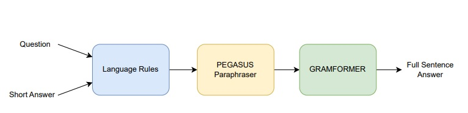

<!-- 
RULES TO FOLLOW BEFORE CONTRIBUTING:

Please refer to the README.md and install the extensions provided.
Images/Flowcharts should go inside the images directory.
Helpful comments are provided above the section for further info.
Comments should be added by the respective contributor to ensure the report is well documented.
 -->

<!-- Picture of IITG and KU goes here; refer to the BSM document sent in the group chat -->
# Internship Report

<!-- use this to insert a page break -->

<!-- The Table of content autopopulates as new sections are added; no need to manually make changes -->
# Table of contents
- [Internship Report](#internship-report)
- [Table of contents](#table-of-contents)
- [Acknowledgement](#acknowledgement)
- [Abstract](#abstract)
- [Project Objectives](#project-objectives)
  - [Understanding the dataset](#understanding-the-dataset)
  - [Creation of a data preprocessing pipeline](#creation-of-a-data-preprocessing-pipeline)
- [Methodology](#methodology)
- [Data correction](#data-correction)
  - [Approaches](#approaches)
    - [Approach #1 (nltk method)](#approach-1-nltk-method)
      - [Algorithm](#algorithm)
      - [Flowchart](#flowchart)
    - [Approach #2 (LLM method)](#approach-2-llm-method)
      - [Algorithm](#algorithm-1)
      - [Flowchart](#flowchart-1)
- [Error Analysis](#error-analysis)
  - [Type 1 Error (Context Error)](#type-1-error-context-error)
      - [Algorithm](#algorithm-2)
      - [Flowchart](#flowchart-2)
      - [Output](#output)
  - [Type 2 Error (Grammatical Error)](#type-2-error-grammatical-error)
      - [Algorithm](#algorithm-3)
      - [Flowchart](#flowchart-3)
      - [Output](#output-1)
  - [Type 3 Error (Typographical Error)](#type-3-error-typographical-error)
      - [Algorithm](#algorithm-4)
      - [Flowchart](#flowchart-4)
      - [Output](#output-2)
  - [Finding Commonalities in the Error](#finding-commonalities-in-the-error)
      - [Algorithm](#algorithm-5)
      - [Flowchart](#flowchart-5)
      - [Output](#output-3)
- [Conclusion](#conclusion)

# Acknowledgement
lorem ipsum

# Abstract
lorem ipsum

# Project Objectives
The Task Directed Image Understanding Challenge (TDIUC) dataset is a collection of data for Visual Question Answering (VQA). It comprises 1.6 million questions and 170,000 images gathered from sources like MS COCO and the Visual Genome Dataset. Each question posses an short answer. These questions are paired with images and categorized into 12 distinct groups. The various question categories are briefly defined in the Table 1.
Additionally, there are four supplementary evaluation metrics designed to assess the robustness of models in handling imbalanced answers and their capacity to respond to questions demanding higher-level reasoning. TDIUC divides the VQA task into various question types, ranging from simpler ones like object presence and color attributes to more intricate tasks such as counting and positional reasoning. To balance the dataset, an “Absurd” question category is also included, where questions are unrelated to the image content. We have used the TDIUC dataset for Sentence-based Visual Question Answering (SVQA).

## Understanding the dataset
The answers which were initially written as single words, were converted to a complete sentence by using the three-step procedure shown in Fig.1. The initial step involves converting concise answers into complete sentences by applying a set of language rules, which are outilned and summarized in Fig.2.  the subsequent stage, sentences were
subjected to paraphrasing using the Pegasus paraphraser, a transformer-based model [6], to generate alternative answers to the questions. This is done to increase the dataset’s linguistic capacity and add variety to the answers. The last phase involves inspecting and correcting the grammar of the sentences through the utilization of
Gramformer [7], a transformer-based model. The table in 2 provides a summary of the grammatical accuracy of answers for each question type. We have not considered the Absured category as it only reply as “ does not apply”.

## Creation of a data preprocessing pipeline 

# Methodology
lorem ipsum

# Data correction
## Approaches
### Approach #1 (nltk method)
#### Algorithm
#### Flowchart
### Approach #2 (LLM method)
#### Algorithm
#### Flowchart

# Error Analysis
## Type 1 Error (Context Error)
#### Algorithm
#### Flowchart
#### Output
## Type 2 Error (Grammatical Error)
#### Algorithm
#### Flowchart
#### Output
## Type 3 Error (Typographical Error)
#### Algorithm
#### Flowchart
#### Output
## Finding Commonalities in the Error
#### Algorithm
#### Flowchart
#### Output

# Conclusion
lorem ipsum